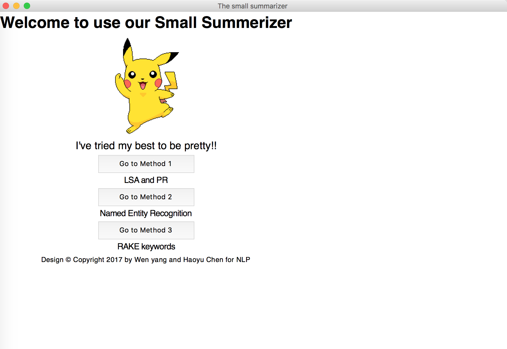
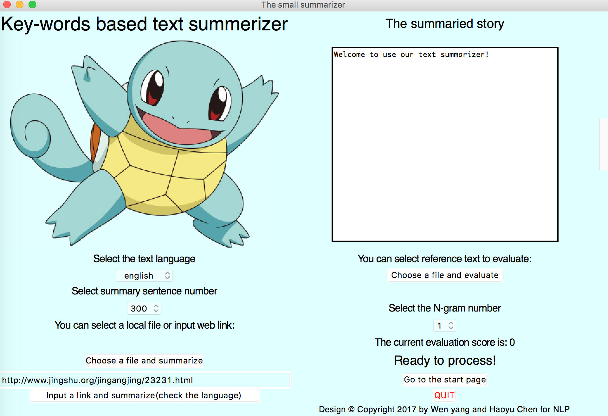
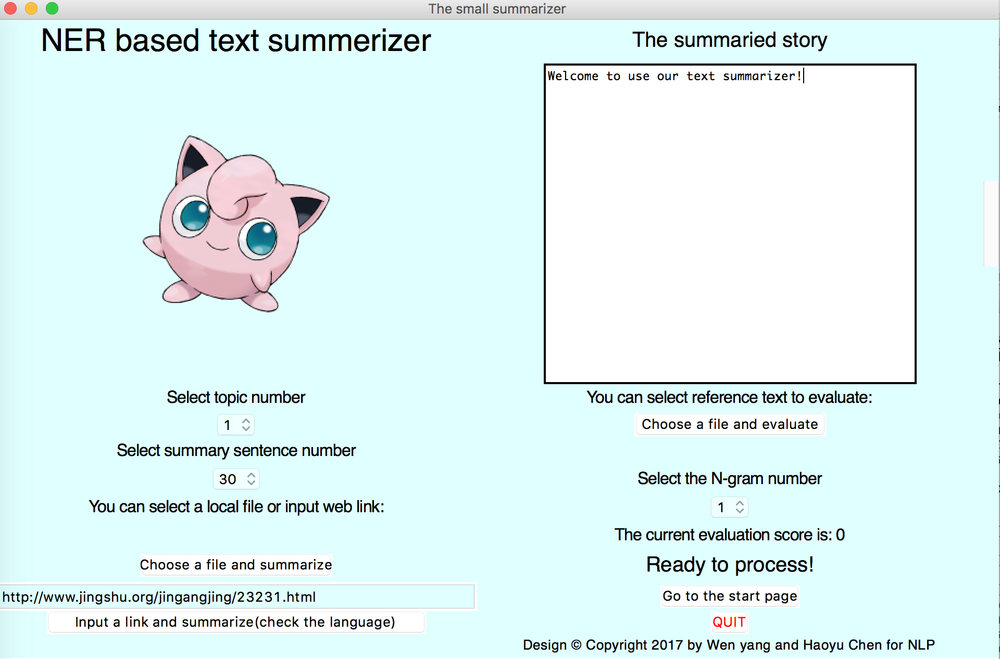
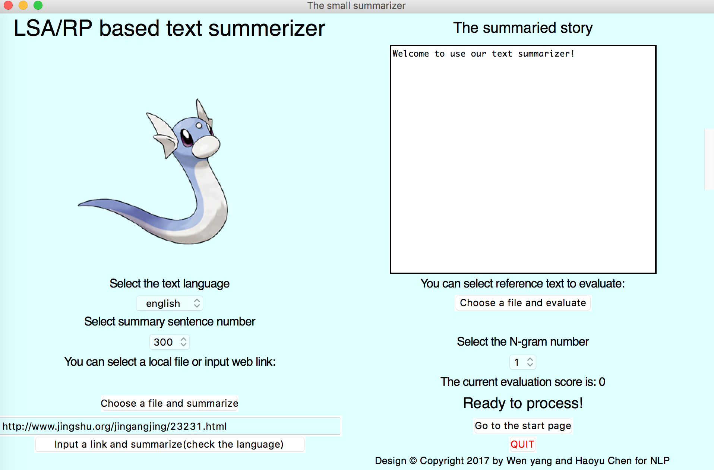
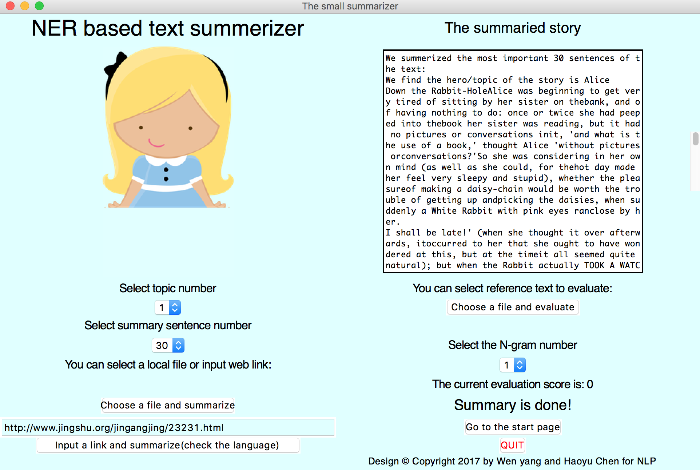

'Design © Copyright 2018 by Haoyu Chen'

A small cute text summerizer (in three different methods)
==========================
小小总结器：具有三种总结方法的文本总结器

A small and cute text summerizer for summerizing a short version of given texts or websites @chenhaoyu

## Requirements and Dependencies
    - Python 2.7 or 3.5
    - Using [Anaconda](https://www.anaconda.com/download/) is recommended.
    - Qt
    
## UI 界面：
1. Main page

    

2. key-word summerizer

    

3. NER summerizer

    

    
4. LSA summerizer

    

5. NER summerizer result (test file is, Alice's Adventures in Wonderland)
It can summerize the hero as Alice, and search online with 'Alice' and show it in realtime.

    

## Usage 使用：
    '''
    python NLPfinalUI.py 
    '''
    
that's all

## Function 功能：

1. 支持三种不同总结方法
Support 3 different summerization methods

2. 支持中英文
Support English and Chinese text

3. 支持网页输入总结
Support website text analysis by link

4. 支持总结句子数量选择
Support chosing number of summerization sentences

5. 支持N-rouge对总结的文本评分
Support evluation the results by N-rouge

6. 支持NER方法中，确定故事主人公之后，加入了后台实时搜索并显示主人公图片的功能
Insteresting function: automatically find the hero of the text, and search online in background, and shows the hero in realtime. 

## Note 注意事项：
1.总结中文文本的时候，语言选项要改成Chinese，不然会崩溃

Change the language option before try chinese input, otherwise it goes crash

2.不要输入太大的文本，不然会崩溃
Don't try too long text, otherwise it goes crash.

3.要用N-rouge评估文本的话，需要用到参考文本，在textdata/has_reference 文件夹中有一些
To evaluate the result, there are some human summarized reference in textdata/has_reference fold.

## To do 还没搞定：

1.HMM的训练没时间做了
Train with HMM 

2.文本框需要点击一下才能出现文字
Sometimes, you need to click the text box before it shows.

## Acknowledge
This application of the final project of NLP course. Team member: Haoyu Chen, Wen Yang.

Copyright@ University of Oulu
